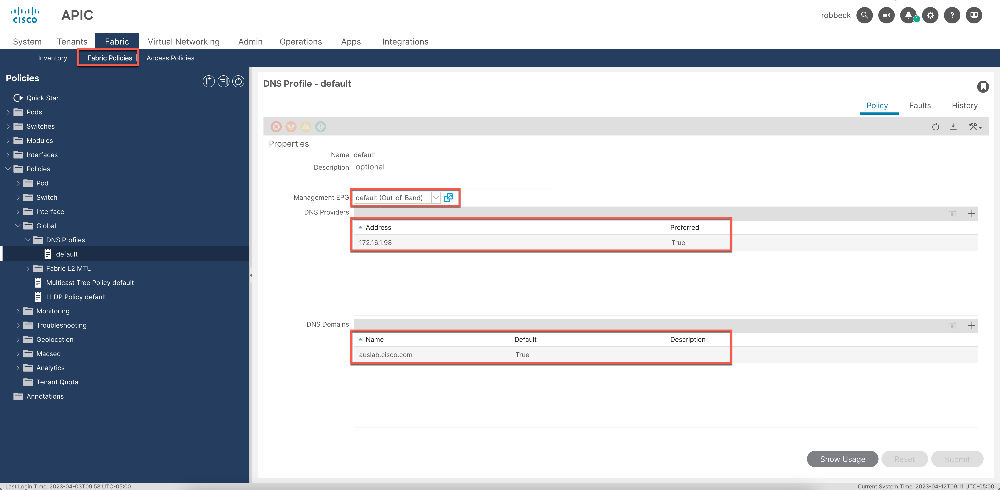
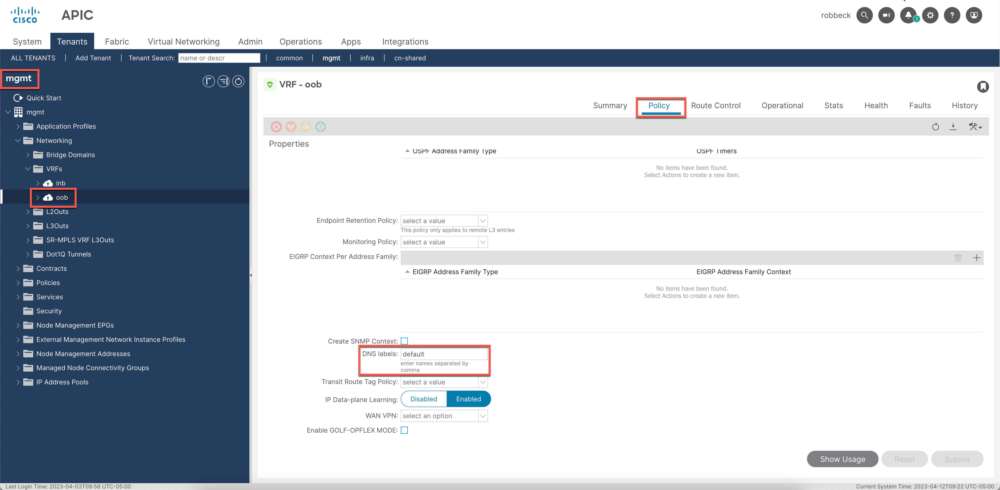
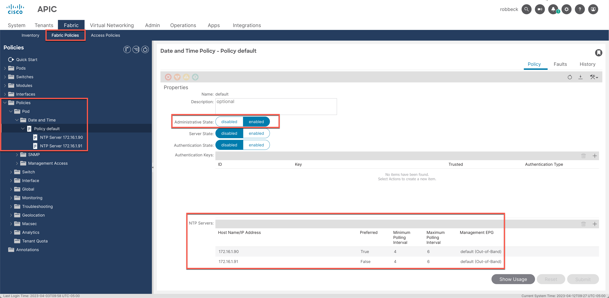
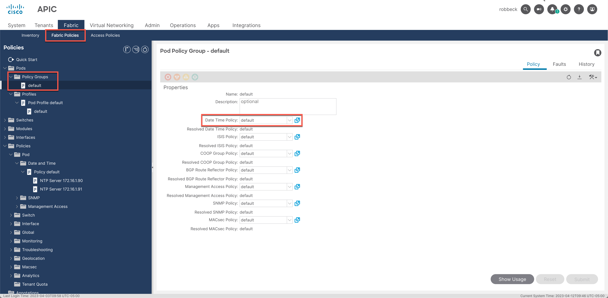
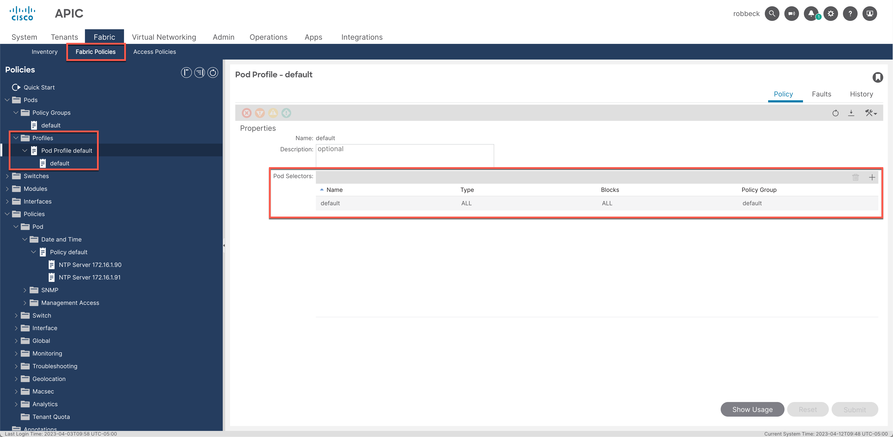
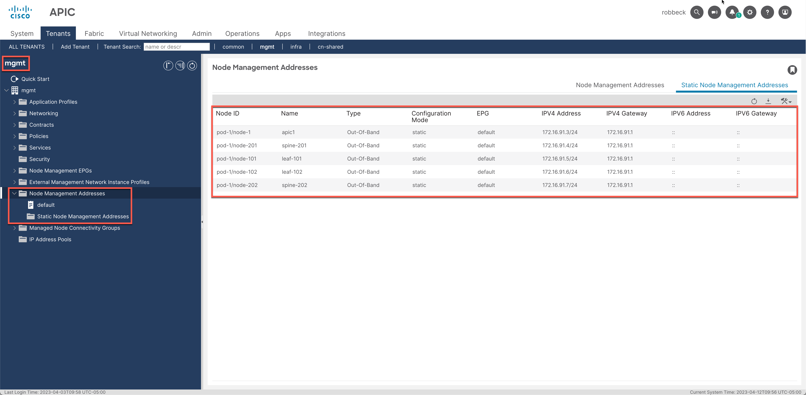

# Common issues for onboarding

Below you will find some common causes for failed checkpoints within the excel report for your site.  Please open an issue on this repo if there are additional failure reasons you would like to see example fixes for.

## ACI

### DNS not configured properly

DNS configuration requires a DNS profile be configured under `Fabric -> Fabric Policies -> Policies -> Global -> DNS Profiles`.  The DNS profile should use a Management EPG tied to out-of-band such as default (Out-of-Band). At least one DNS provider **AND** at least one DNS Domain is required.  Below is an example DNS policy:

After a valid profile is defined then that profile must be applied to the `oob` vrf in the `mgmt` tenant as a DNS label.  This is done under `Tenants -> mgmt -> Networking -> VRFs -> oob -> Policy` as shown below:

### NTP not configured properly

NTP configuration requires a `Date and Time` policy be configured under `Fabric -> Policies -> Pod -> Date and Time` with at least one NTP server configured as shown below:

Once the policy is configured it must be applied to a `Pod Policy Group` and then applied to nodes via `Pod Profile -> Pod Selectors` as shown in the images below:

The policy group is linked to a node via `Pod Selectors`.  In the screenshot below a special type of selector is defined matching `ALL` pods.  Alternatively, you could define a pod range with selector blocks.

### OOB management address not configured on node(s)

In order for nodes to stream telemetry to Nexus Cloud, they must have Out-of-Band management addresses assigned.  You can configure these addresses via `IP Address Pools` or via `Static Node Management Addresses` under `Tenants -> mgmt -> Node Management Addresses` as shown below:

### Device Connector version not supported

The device connector version is typically bundled with the ACI firmware.  If you are running a supported version of ACI firmware but the report shows an unsupported device connector version then please open a support case with Cisco TAC to help resolve the issue.

### Cloud Connector or Cloud Vision version not supported

Cloud Connector and Cloud Vision apps should be upgraded as part of the ACI firmware installation of a supported version.  If you are running a supported version of ACI firmware but the report shows an unsupported version of either of these apps or if any faults are found on these apps then please open a support case with Cisco TAC to help resolve the issue(s).

### Model or Firmware not supported

The supported hardware and firmware currently supported for Nexus cloud can be found in the [Nexus Cloud Getting Started -> Preparing ACI Fabrics](https://docs.nexuscloud.com/story/nexus-cloud-getting-started/page/5/1) guide.  Please contact your local Cisco account team with any questions regarding the supported combinations.

### Nexus Dashboard Insights integration detected

Nexus cloud does NOT currently support ACI fabrics tied to an existing Nexus Dashboard Insights instance with streaming telemetry configured.  This site would need to be removed from the NDI instance in order for streaming telemetry to be sent to Nexus Cloud.

## NXOS

### DNS not configured properly

Ensure both DNS provider(s) and search domain are configured under the `management` VRF.  While the device connector can communicate with Nexus Cloud via any VRF the streaming telemetry service requires communication via the Out-of-Band management VRF. You can confirm this by issuing the `show run vrf management` command and verify the dns configuration exists.

### NTP not configured properly

NTP is required to ensure trust can be established between the NXOS nodes and Nexus Cloud.  It is also vital for the accuracy of streaming telemetry data. The NTP configuration can be verified by issuing `show run ntp` on the target Nexus switch.  If NTP configuration exists but the report still reports an issue then please verify the configured NTP server is reachable via the configured source interface.

### Existing telemetry configuration exists

Nexus cloud does NOT currently support NXOS devices tied to an existing Nexus Dashboard Insights instance with streaming telemetry configured.  The reported switches would need to be removed from the NDI instance in order for streaming telemetry to be sent to Nexus Cloud.

### Discovery protocols not detected

Nexus Cloud requires either CDP or LLDP be enable to support automated fabric discovery.  If you want to use automated fabric discovery instead of manually adding switches one at a time then enable either of these services.

### Ping test fails

Currently the ping test is simply verifying that the necessary Nexus Cloud services are resolving.  It does not actually test that the services are reachable on port 443 so if this check passes but the switch is still not fully discovered please verify that any upstream firewalls and/or proxy is configured to allow this communication.  Refer to the [Getting Started Guide](https://docs.nexuscloud.com/story/nexus-cloud-getting-started/page/7/5) for more details.

### Mgmt IP not detected

Nexus Cloud requires Out-of-Band management be configured on **ALL** NXOS switches within a site in order to properly stream information to the Nexus Cloud services.  If this check fails then ensure an IP address is assigned to the management interface and that the necessary routing is in place on the default VRF to communicate with Nexus Cloud.

### Model or Version not supported

The supported hardware and firmware currently supported for Nexus cloud can be found in the [Nexus Cloud Getting Started -> Preparing Nexus switches](https://docs.nexuscloud.com/story/nexus-cloud-getting-started/page/7/1) guide.  Please contact your local Cisco account team with any questions regarding the supported combinations.